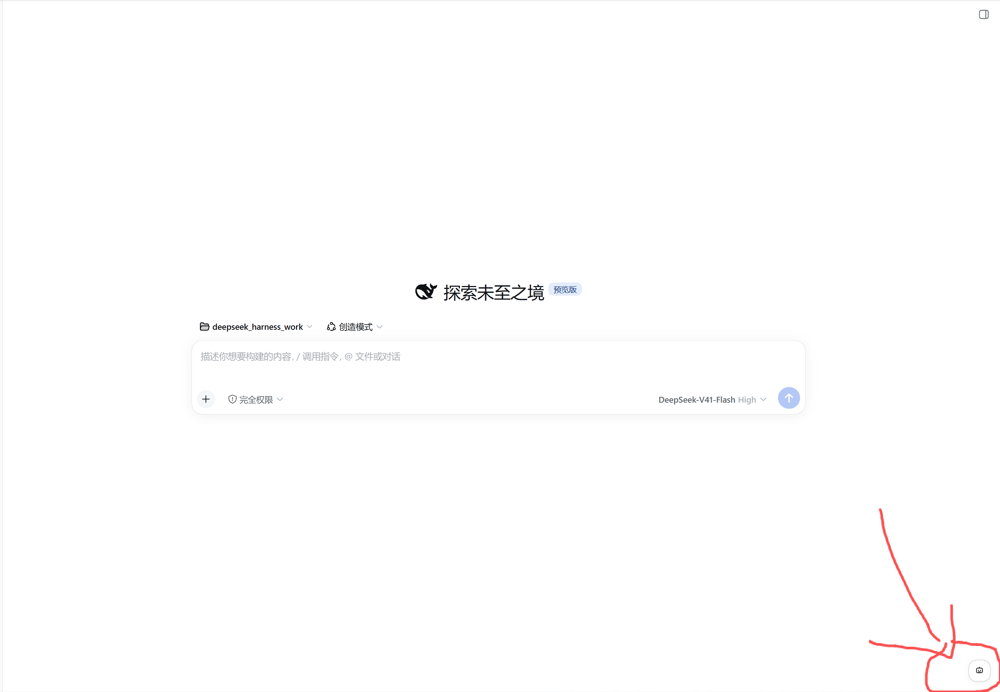

# dsh-agent-instructions

给 **dsh 原生的 `AGENTS.md`** 加一个 Web UI 编辑器，并把官方的指令加载语义如实反映到界面上。

人格、称呼、语气这些内容**就写在 `AGENTS.md` 里**，由你自己撰写 —— 插件不管内容语义。

```sh
# 安装（在任意目录执行）
dsh plugin --profile web add github:Bay-Zeddie/dsh-agent-instructions
dsh web           # 重启后生效
```

装好后在 **设置 → Agent 身份与指令** 打开（或点右下角浮动按钮）。

> 想改代码：`git clone` 后 `dsh plugin --profile web add <本地绝对路径>`，改完刷新页面即可（client 侧热生效）。

- ✅ 读 / 改 / 存 **任意一层**：`<DSH_HOME>/AGENTS.md` 与工作区链上每一层的 4 个候选名
- ✅ **指令预算可视化**：复刻官方发现链，算真实的字节占用与超预算裁剪
- ✅ **列表即编辑器**：按读取顺序列出每一层，**点哪一行就在下面编辑那一份**（每个标作用范围 + 字节 + 状态点：生效 / 已暂停 / 太长会被丢掉 / 太长会被截断 / 不会被读取 / 内容重复）
- ✅ **三种生效范围**：`工作区 + 全局` / `仅工作区` / `仅全局` —— 暂停即**改名**（加 `.disabled`），内容一字节不丢，随时恢复
- ✅ **每一层都能单独暂停/启用**（全局层与项目层走同一套机制，不再有"只有全局能暂停"的特例）
- ✅ 手写 React bundle（`React.createElement`，不用 JSX）+ 官方 `ui-primitives` 控件，**无构建步骤、无第三方依赖**
- ✅ 样式全部读取 dsh 的 `--dsw-*` 设计 token，**自动跟随明暗主题与字号**
- ❌ **不修改任何 dsh 源码**，只做适配
- ❌ 不注入系统提示词、不写入第二份身份文件、不改动 dsh 原生行为

---


> 想改代码 / 了解内部实现？见 [CONTRIBUTING.md](./CONTRIBUTING.md)。

## 界面预览

装好后，dsh 首页的**右下角会出现一个圆形浮动按钮** —— 点它就是本插件的面板
（也可以从 **设置 → Agent 身份与指令** 进入）：



> 这个按钮**平时都在**；只有当它会被聊天输入区挡住时才会自动淡出（避免压住发送按钮）。

## 访问范围（这个插件碰什么、不碰什么）

> 收录指南要求 README 讲清"插件访问什么"，这里如实列出。host 侧只 `import` 了
> `node:crypto` / `node:fs` / `node:fs/promises` / `node:os` / `node:path` —— **没有任何网络模块**。

| 类别 | 具体范围 |
|---|---|
| **读** | ① 指令链上的候选文件（`AGENTS.md` / `CLAUDE.md` / `AGENTS.local.md` / `CLAUDE.local.md` 及其 `.disabled` 变体）<br>② `settings.yaml` —— **只读** `agent-presets.default` 一个字段（取 preset 名）<br>③ 该 preset 的 `agent.cordis.yml` —— **只读** `maxBytes`（渲染预算上限）<br>④ `.git` —— 仅作为"项目根"的**存在性标记**探测，**不读其内容** |
| **写** | **仅限指令链白名单内的文件**：`AGENTS.md` / `AGENTS.local.md` 及其 `.disabled` 变体。<br>落盘走**原子写**（同目录临时文件 + `rename`，中途崩溃不会截断原文件）；写入前会弹确认框 |
| **改名** | 同上白名单 —— 「暂停/恢复」靠**加/去 `.disabled` 后缀**实现，**内容一个字节不删** |
| **网络** | **零外部请求**。不发任何出站连接；也不向任何第三方上报数据 |
| **会话** | **不读取**。插件不碰 session 记录、不读对话内容 |
| **拒绝的路径** | 链外路径一律拒绝（实测 6 类链外路径必须返回 403）；`base` 必须是**官方候选名位置**，`.disabled` 由 base 推导、不接受外部直接指定 |


## 安装 / 卸载

```sh
# 安装（在插件目录内执行）
dsh plugin --profile web add .

# 重启生效（host 侧代码在进程启动时装载）
dsh web
```

```sh
# 卸载：先注销，再删链接与源码（顺序不要反，否则会在 profile 里留下断链）
dsh plugin --profile web remove dsh-agent-instructions
```

> `pnpm remove` **不会**清理 `node_modules/dsh-agent-instructions` 符号链接（link 安装的通病），需手动删除该链接。
> link 安装时依赖必须装在**插件源码目录**（Node 从源码 realpath 解析）。

---


## 两级 AGENTS.md（官方机制）

| 层级 | 路径 | 生效范围 | 本插件入口 |
|---|---|---|---|
| **用户全局** | `<DSH_HOME>/AGENTS.md`（默认 `~/.dsh/AGENTS.md`） | 该用户**所有工作区** | 列表第 1 行 —— 点它即编辑，右侧开关即暂停/启用 |
| **项目级** | `<工作区>/AGENTS.md` 等 4 个候选名，逐层 | 该工作区（含更深层） | 列表其余每一层 —— **每行一个编辑入口 + 一个开关** |
| **个性化（本地叠加）** | `<工作区>/AGENTS.local.md` | 该工作区；在 `AGENTS.md` **之后**加载 ⇒ **优先级更高**；**仅全局模式下不可用** | 工作区那层的**额外一行「个性化规则」** —— 不存在也显示，点它写入即创建；编辑器给的是「我的偏好 + 补充约定」预设；通常不进版本控制 |

- 顺序：**从宽泛到具体**（全局 → 项目根 → … → 会话工作目录）
- 预算：合计上限由 preset 声明（官方默认 **65536 字节**）；超出时**宽泛的先被省略**
- 项目根靠 `.git` 识别；`AGENTS.local.md` / `CLAUDE.local.md` 是本地叠加层
- ⚠️ **本地叠加层只在项目 scope 存在，全局 scope 没有**（官方 `agent-instructions/README.zh.md` 原文：
  "项目 scope 默认加载 … overlay，但用户全局 `$DSH_HOME` scope 没有本地 overlay"）。代码上
  `files.ts:285` 的全局发现用的是写死的 `USER_GLOBAL_FILE = 'AGENTS.md'`（`render.ts:98`），
  **完全不遍历候选列表** —— 所以连 `localInstructionFileCandidates` 配置项也覆盖不到它。
  ⇒ 想让规则对**所有工作区**生效，只能写进 `~/.dsh/AGENTS.md` 本身（那是唯一文件，不是叠加层）
- 补充实测：若会话 cwd 恰为 `$DSH_HOME`，则 `~/.dsh/AGENTS.local.md` **会被读到** —— 但它的层身份
  仍是 **`project`**（被"项目目录"逻辑捡到的），不是全局层。换句话说：文件能读到 ≠ 全局层支持它
- **生效时机**：官方挂的是 `ctx.on('agent/pre-step', …)` 钩子 —— **每一步请求前都会重新合成**，
  并按内容摘要（`baseline.changes`）检测变化后增量替换 ⇒ 改名/改内容**不需要重启，对之后的请求即时生效**，
  同一会话内也会刷新（与 preset 层不同）
- **`$DSH_HOME` 解析**（复刻官方优先级）：显式配置 → `$DSH_HOME` 环境变量 → `~/.dsh`；纯空白视为未设置

---


## 已知取舍

1. **导航项图标无法自定义** —— `ui-settings-general` 的 `navIcon(id)` 是**硬编码的 if-else 表**（只认 `models` / `agent-presets` / `plugins` / `archived-sessions`，其余兜底为齿轮），且 `settings.section` 的注册选项里**没有 `icon` 字段**。因此机器人图标只出现在**浮动按钮**与**页面标题**这两个自己能控制的表面。
2. **已接入官方 slot 体系**（设置页独立页 `settings.section`）。**这不需要构建链**：官方客户端产物的依赖形式
   就是普通 `require`——`require("react")` / `require("react-dom/client")` /
   `require("@deepseek-ai/dsh-client-ui-primitives")`，实测**无需在 `package.json` 里声明**即可解析（走共享静态表），
   组件用 `React.createElement` 写、不用 JSX。官方注册形式：

   ```js
   ctx.slots.inject('settings.section', () => ctx.slots.register({
     name: 'settings.section', id: 'dsh-agent', order: 60, priority: 60, label: <导航文案>,
   }, Component))
   ```

   ⚠️ `ctx.slots.register(options, component)` **只有两个参数**（社区某插件传的第三个 `true` 是多余实参，别照抄）；
   slot 名未被父节点声明时会 `throw` ⇒ 注册必须包 `try/catch` **并准备回退入口**。
   ⚠️ 注意两处同名但语义不同的 `inject`：**bundle 里的 `exports.inject`** 是 **cordis 服务注入表**
   （要用 `ctx.slots` 就得写 `['slots']`）；**`package.json` 的 `dsh.client.inject`** 才是模块/包级别声明。
3. **不做格式化 / 预览** —— 有意为之：AGENTS.md 是纯文本契约，插件不该重新排版它。
4. **预算为近似值** —— 只算文件字节，不含官方渲染边框（见上文口径说明）。
5. **暂停靠改名，会在磁盘上留痕** —— `.disabled` 是**真实的文件名变更**。若该目录是 git 仓库，`git status` 会显示一行改名；
   **不 `git add` 就只停在工作区，不进索引、不进历史**（所以"误提交"不是会自动发生的风险，而是需要你主动做的动作）。
   这是"不改官方源码、不写配置"的必然代价，换来的是**随时可逆、内容零损失**。
6. **未处理工作区目录不存在** —— 保存到不存在的目录会返回 404。

---
